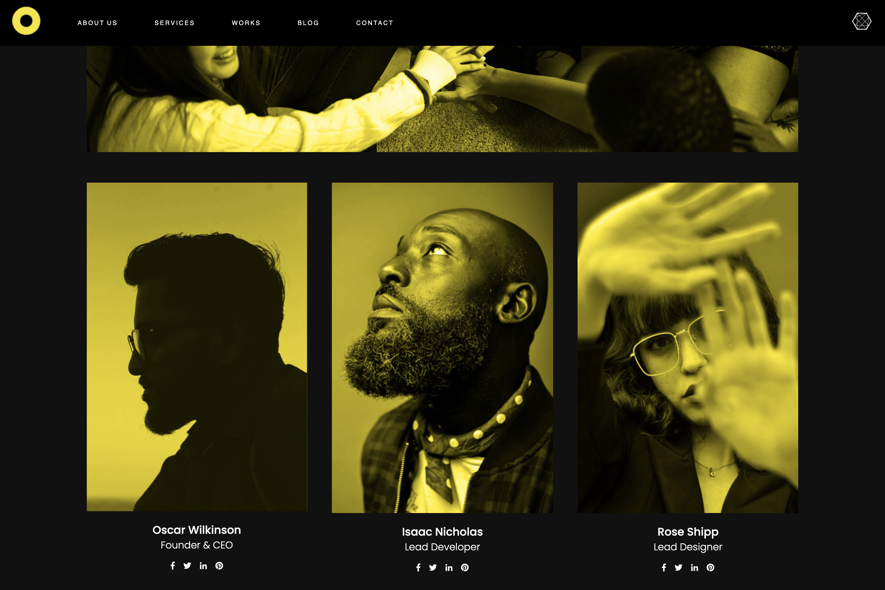

# Web Design Agency!

> **Concept**: Website for designers and developers. 


## 🌍 Accessibility


```Check it online:``` https://webdesignagency-kg.web.app/


### 🔮 Home Page

### 🥺 About Us



## 💥 Aplication and functionality

* Website composed from 6 tabs on the different routes
* Controlled components
* Reviews in the form of carousel
* Controlled contact form
* Light CSS animations
* Responsive Web Design (RWD)

## 📓 Used Technologies:

- Create React App
- React
- React Router
- React Form
- React Hooks
- React Hamburger menu
- React Slick
- Slick Carousel
- Controlled contact form
- Node Sass
- Firebase Hosting


## ⚙️ How to install:
1. ``` git clone https://github.com/konradgauza/WebDesign.git ```
2. ``` cd WebDesign ```
3. ``` npm i ```
4. ``` npm start ```